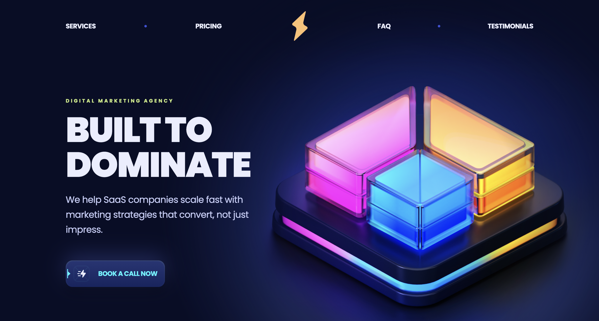
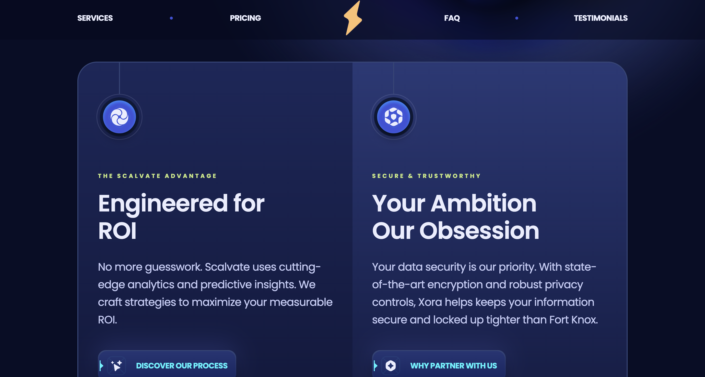

<div align="center">
  <br />
    
    
  <br />

  <div>
    
    
    
  </div>

  <h3 align="center">Modern UI/UX SCALVATE Website</h3>

</div>

---

## 📋 Table of Contents

1. 🤖 [Introduction](#introduction)
2. ⚙️ [Tech Stack](#tech-stack)
3. 🔋 [Features](#features)
4. 🤸 [Quick Start](#quick-start)
7. 🚀 [More](#more)

---

## 🤖 Introduction

**Scalvate** is a Modern UI/UX SaaS website developed using **React.js**, **Vite**, and **Tailwind CSS**, designed with sleek animations, responsive layout, and best-in-class component reusability. It's built as a high-converting template for any SaaS startup.

---

## ⚙️ Tech Stack

- 🧪 **Vite**
- ⚛️ **React.js**
- 🌬️ **Tailwind CSS**

---

## 🔋 Features

- 🚀 **Hero, Features, Pricing, FAQ, Testimonials, Download**
- 🎞️ **Smooth & Modern Animations**
- 🎨 **Custom CSS Gradients with Pseudo Elements**
- 🧭 **Seamless Navigation & Scroll Behavior**
- ⚡ **Performance Optimized for Speed**
- 📱 **Fully Responsive Across Devices**
- 🧩 **Component-based Architecture for Reusability**

---

## 🤸 Quick Start

### Prerequisites

Make sure you have these installed:

- [Git](https://git-scm.com/)
- [Node.js](https://nodejs.org/)
- [npm](https://www.npmjs.com/)

### Clone & Install

```bash
git clone https://github.com/OzgurDevFolio/scalvate-website.git
cd xora
npm install
